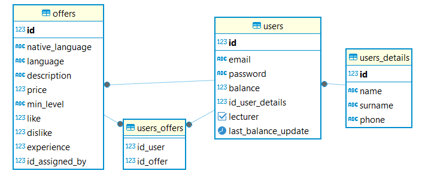
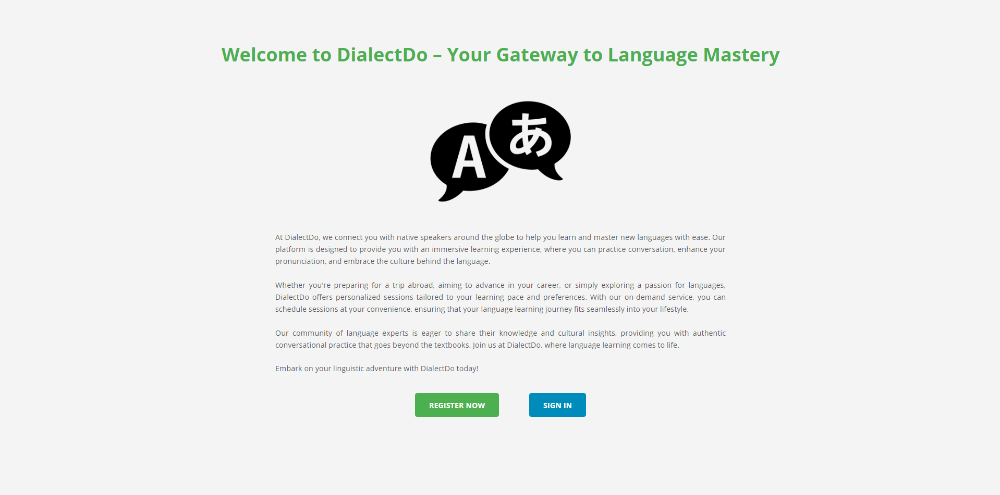
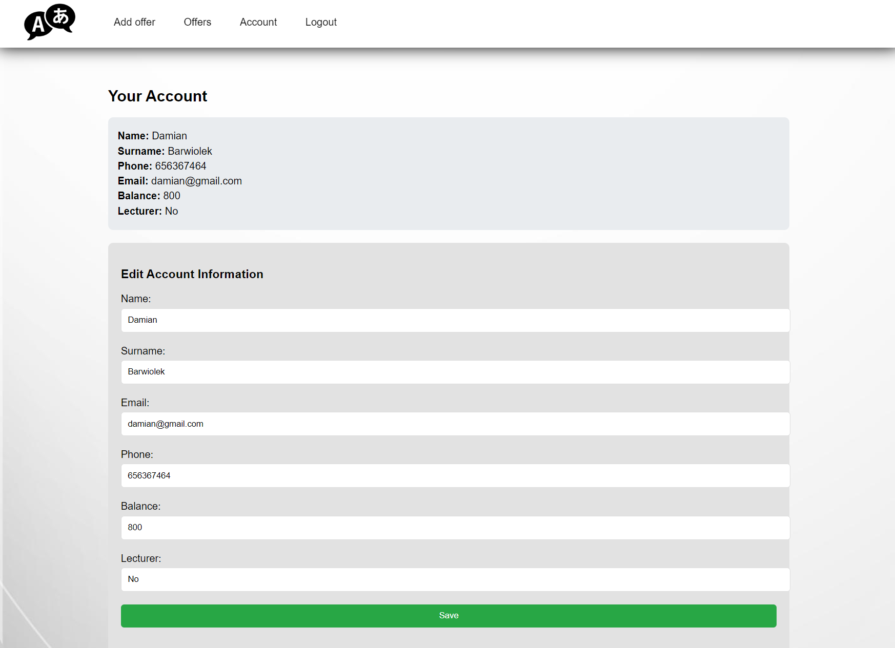
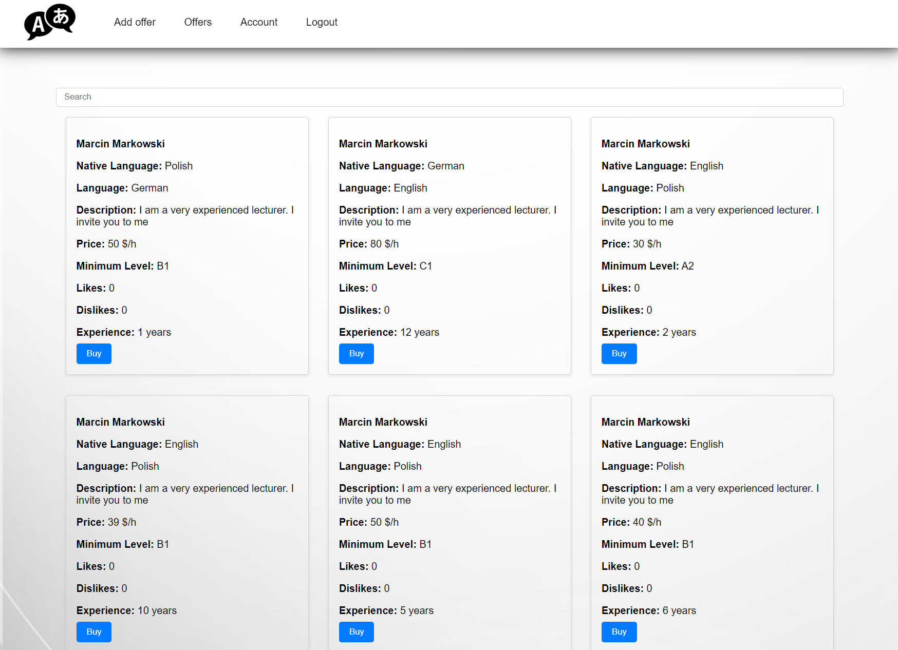
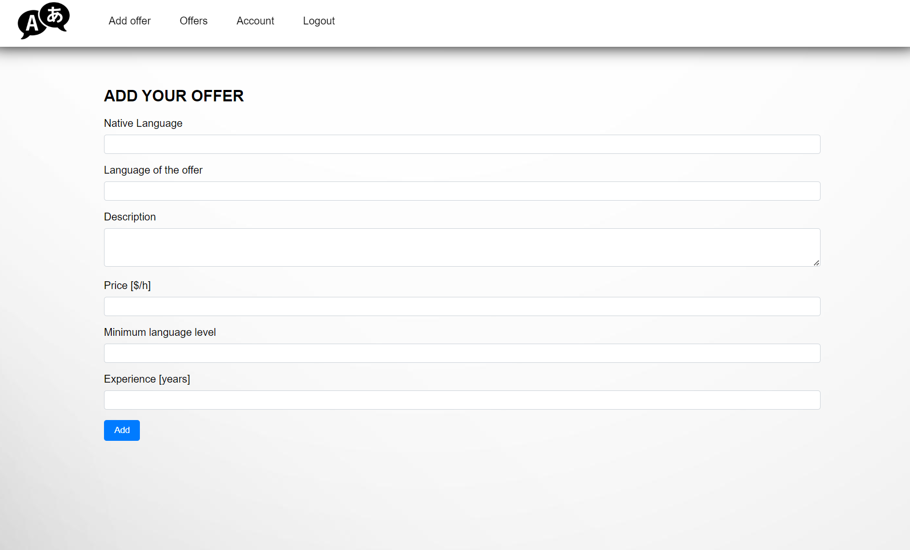

# DialectDo

An application created for the subject "Introduction to Web Application Design".
DialectDo is an auction service designed for individuals who want to offer tutoring services or take advantage of them.

## Table of Contents

- [Installation](#installation)
- [Running](#running)
- [Usage](#usage)
- [Features](#features)
- [Technologies](#technologies)
- [Database](#database)
- [ERD Diagram](#erd-diagram)
- [Authors](#authors)
- [Contact](#contact)
- [Licence](#license)
- [Screenshots](#screenshots)

## Installation

To install the application, follow these steps:

```bash
git clone https://github.com/BarwiolekDamian/WdPAI.git
```

## Running

To run the application, follow these steps:

```bash
cd dialectdo
docker compose build
docker compose up
```

## Usage

Aby korzystać z aplikacji należy wejść na stronę:

```html
http://localhost:8080
```

## Features

- Registration
- Login
- Posting Offers
- Searching for Offers
- Updating User Data
- Depositing Money and Purchasing a Course (simplified version)
- Changing User Type
- Searching for Offers by Language

## Technologies
- PHP
- JavaScript
- PostgreSQL
- HTML
- CSS

## Database

- <b>Trigger</b> => upon updating the user's account balance, it updates 'last_balance_update' to the current time.
- <b>Function</b> => adds an offer to the 'offers' table and returns the offer ID.

## ERD Diagram



## Authors

-   Damian Barwiołek

## Contact

If you have any questions, contact me via email: damian.barwiolek@student.pk.edu.pl

## License

[MIT](https://choosealicense.com/licenses/mit/)

# Screenshots





